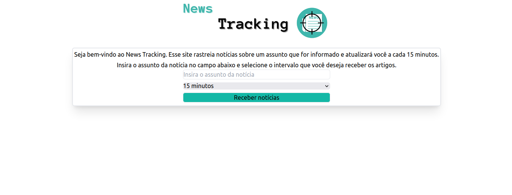

# NEWS TRACKING




> O News Tracking é uma aplicação que permite que você acompanhe de perto qualquer assunto de seu interesse. Basta digitar o título da notícia e selecionar um intervalo de tempo predefinido. De acordo com o intervalo selecionado a aplicação realizará buscas visando encontrar novos artigos sobre o assunto. 📰

## 💻 Pré-requisitos
A versão com Docker está no branch `docker`, [clique aqui](https://github.com/CiceroWesley/news-tracking/tree/docker).

Antes de começar, verifique se você atendeu aos seguintes requisitos:
* Você instalou a versão 23.0.3 do `Docker`?

## 🚀 Instalando o News Tracking

Para instalar o News Tracking, siga esta etapa:

Linux:
```
1. Execute sudo docker compose build
```

## ☕ Usando o News Tracking
Para usar o News Tracking, siga esta etapa:

```
1. Sete a porta da API na variável de ambiente PORT em backend/.env
2. Sete a URL da API no frontend na variável de ambiente VITE_API_URL em frontend/.env
3. Execute sudo docker compose up
4. Acesse a aplicação via navegador em http://localhost:5173
```

## 📝 Licença
Esse projeto está sob licença. Veja o arquivo [LICENÇA](LICENSE) para mais detalhes.

[⬆ Voltar ao topo](#news-e-tracking)<br>